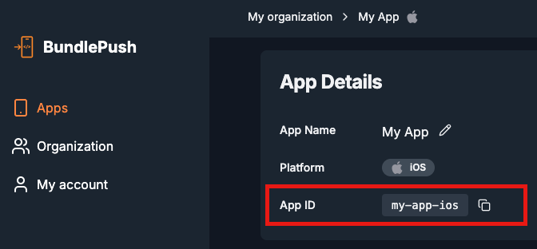

# BundlePush: Using Objective-C

Below are the steps to integrate BundlePush in an Objective-C environment.

---

## 1. Add the import directive

In your AppDelegate, import the BundlePush native header:

```objc
#import <bundlepush/BundlepushNative.h>
```

---

## 2. Add a snippet of code to perform the update

Inside your `AppDelegate.m` or `AppDelegate.mm`, locate the method:

```objc
- (BOOL)application:(UIApplication *)application didFinishLaunchingWithOptions:(NSDictionary *)launchOptions
{
    // Your existing code...

    // Initialize BundlePush with your App ID
    [BundlepushNative setupWithAppID:@"YOUR_APP_ID"];

    // Your existing code...
}
```

> Replace `"YOUR_APP_ID"` with the one from [BundlePush Dashboard](https://dash.bundlepu.sh). It can be found here:



---

## 3. Add a snippet of code to use the latest bundle

Inside the `AppDelegate`'s `- (NSURL *)getBundleURL` or `- (NSURL *)bundleURL`, add the following snippet:

```objc
- (NSURL *)bundleURL
{
  // vvv  Add the lines below  vvv
  NSURL *latest = [BundlepushNative latestBundleURL];
  if (latest != nil) {
    return latest;
  }
  // ^^^  Add the lines above  ^^^
#if DEBUG
  return [[RCTBundleURLProvider sharedSettings] jsBundleURLForBundleRoot:@"index"];
#else
  return [[NSBundle mainBundle] URLForResource:@"main" withExtension:@"jsbundle"];
#endif
}
```
