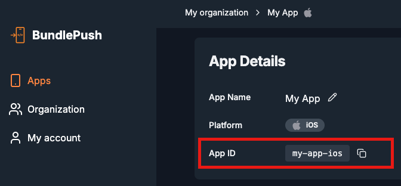

# BundlePush: Using Swift

Below are the steps to integrate BundlePush in a Swift environment.

---

## 1. Create a Bridging Header

Create a bridging header file if you don't have one. You can refer [to this article](https://www.dhiwise.com/post/swift-bridging-headers-what-every-ios-developer-needs-to-know#setting-up-a-bridging-header) to create one.
In the bridging header file, import the BundlePush native header:

```objc
// Your existing code...

#import <bundlepush/BundlepushNative.h>
```

---

## 2. Add a snippet of code to perform the update

Inside your `AppDelegate.swift`, locate the method:

```swift
  override func application(_ application: UIApplication, didFinishLaunchingWithOptions launchOptions: [UIApplication.LaunchOptionsKey : Any]? = nil) -> Bool {
    // Your existing code...
    BundlepushNative.setupWithAppId("YOUR_APP_ID")
    // Your existing code...
  }
```

> Replace `"YOUR_APP_ID"` with the one from [BundlePush Dashboard](https://dash.bundlepu.sh). It can be found here:



---

## 3. Add a snippet of code to use the latest bundle

Inside the `AppDelegate`'s `override func bundleURL() -> URL?`, add the following snippet:

```swift
  override func bundleURL() -> URL? {
    // vvv  Add the lines below  vvv
    let latest = BundlepushNative.latestBundleURL()
    if (latest != nil) {
      return latest
    }
    // ^^^  Add the lines above  ^^^
#if DEBUG
    RCTBundleURLProvider.sharedSettings().jsBundleURL(forBundleRoot: "index")
#else
    Bundle.main.url(forResource: "main", withExtension: "jsbundle")
#endif
  }
```
